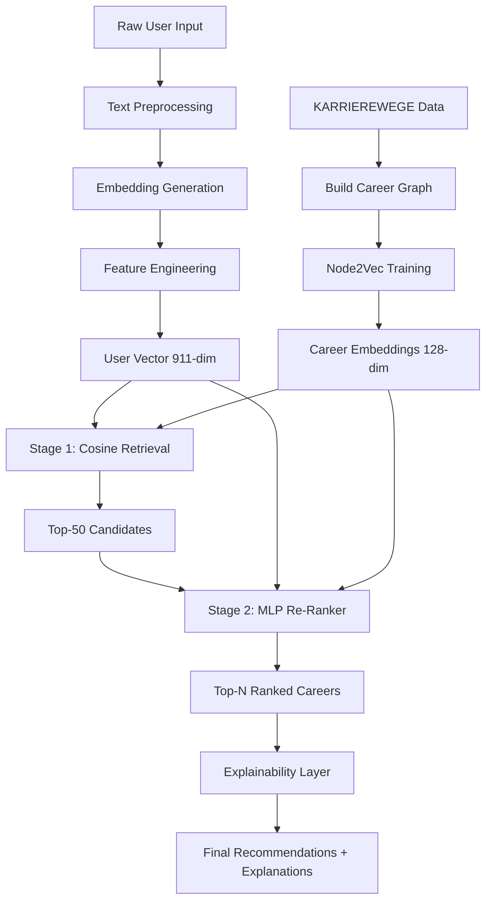

# Feature Engineering & Training Pipeline Specification
## Hybrid Career Recommender System

**Version**: 1.0  
**Date**: November 5, 2025  
**Owner**: CareerLens ML Team

---

## 1. System Overview

### 1.1 Architecture Type
**Hybrid Recommender** = Content-based (skill/interest matching) + Collaborative Filtering (career transition graph) + Neural Re-ranker

### 1.2 Input Schema

```python
UserProfile:
  - age: int (16-80)
  - education_level: str (High School, Bachelor's, Master's, PhD, Bootcamp, etc.)
  - grades_gpa: float (0.0-4.0 or equivalent percentile)
  - interests: str (free text, comma-separated or paragraph)
  - skills: str (free text, comma-separated list)
  - past_roles: list[str] (ordered sequence, most recent first)
  - location: str | None (city/country for location-aware recommendations)
  - years_experience: int (derived or explicit)
```

### 1.3 Output Schema

```python
CareerRecommendation:
  - career_path: str (standardized job title)
  - fit_score: float (0.0-1.0, normalized composite score)
  - rank: int (1-N)
  - explanation: dict[str, Any]
    - matching_skills: list[str]
    - missing_skills: list[tuple[str, float]]  # (skill, gap_weight)
    - interest_alignment: float
    - typical_trajectory: list[str]  # e.g., ["Junior Analyst", "Analyst", "Senior Analyst"]
    - similar_profiles: int  # count of similar users who succeeded in this path
```

---

## 2. Feature Engineering Pipeline

### 2.1 Text Embedding Layer

#### 2.1.1 Model Selection
- **Primary**: `sentence-transformers/all-MiniLM-L6-v2` (384-dim, fast inference)
- **Alternative**: `sentence-transformers/all-mpnet-base-v2` (768-dim, higher quality)
- **Fallback**: TF-IDF (5000 features) for low-resource environments

#### 2.1.2 Implementation

```python
from sentence_transformers import SentenceTransformer

# Load model (cache locally in ml/artifacts/models/)
embedder = SentenceTransformer('all-MiniLM-L6-v2')

def embed_text(text: str) -> np.ndarray:
    """Generate 384-dim embedding for skills or interests."""
    if not text or pd.isna(text):
        return np.zeros(384)
    # Normalize: lowercase, remove special chars, limit length
    cleaned = text.lower().strip()[:512]
    return embedder.encode(cleaned, show_progress_bar=False)

# Features
skill_embedding = embed_text(user.skills)       # (384,)
interest_embedding = embed_text(user.interests) # (384,)
```

**Preprocessing**:
- Lowercase normalization
- Remove URLs, emails, special characters
- Truncate to 512 tokens (model max)
- Cache embeddings for known skill/interest phrases

---

### 2.2 Education & Grades Normalization

#### 2.2.1 Education Level Encoding

```python
EDUCATION_HIERARCHY = {
    "Some High School": 0,
    "High School": 1,
    "Some College": 2,
    "Associate Degree": 3,
    "Bachelor's": 4,
    "Master's": 5,
    "PhD": 6,
    "Bootcamp": 4,  # Map to Bachelor's equivalent
    "Certificate": 2
}

def encode_education(level: str) -> np.ndarray:
    """Ordinal encoding + one-hot for degree type."""
    ordinal = EDUCATION_HIERARCHY.get(level, 2)  # default: Some College
    onehot = np.zeros(7)
    onehot[ordinal] = 1
    return np.concatenate([
        [ordinal / 6.0],  # normalized ordinal (0-1)
        onehot             # one-hot (7 dims)
    ])  # Total: 8 dimensions
```

#### 2.2.2 Grades/GPA Bucketing

```python
def normalize_grades(gpa: float, scale: str = "4.0") -> float:
    """Convert GPA to 0-1 normalized score."""
    if pd.isna(gpa):
        return 0.5  # neutral default
    
    if scale == "4.0":
        return min(gpa / 4.0, 1.0)
    elif scale == "100":
        return min(gpa / 100.0, 1.0)
    else:
        return 0.5

def bucket_performance(gpa_norm: float) -> int:
    """Ordinal buckets: 0=Below Avg, 1=Average, 2=Above Avg, 3=Excellent."""
    if gpa_norm < 0.6:
        return 0
    elif gpa_norm < 0.75:
        return 1
    elif gpa_norm < 0.9:
        return 2
    else:
        return 3
```

**Features**:
- `education_ordinal`: float (0-1)
- `education_onehot`: 7-dim binary vector
- `gpa_normalized`: float (0-1)
- `performance_bucket`: int (0-3)

---

### 2.3 Career Transition Graph & Node2Vec

#### 2.3.1 Graph Construction from KARRIEREWEGE

```python
import networkx as nx
from node2vec import Node2Vec

def build_career_graph(karrierewege_df: pd.DataFrame) -> nx.DiGraph:
    """Build directed graph of job_title transitions."""
    G = nx.DiGraph()
    
    # Group by user/person_id to extract sequences
    for person_id, group in karrierewege_df.groupby('person_id'):
        roles = group.sort_values('start_date')['job_title'].tolist()
        
        # Add edges for sequential transitions
        for i in range(len(roles) - 1):
            source, target = roles[i], roles[i+1]
            if G.has_edge(source, target):
                G[source][target]['weight'] += 1
            else:
                G.add_edge(source, target, weight=1)
    
    return G

def train_node2vec(G: nx.DiGraph, dimensions=128, walk_length=10, 
                   num_walks=50, workers=4) -> dict[str, np.ndarray]:
    """Generate job_title embeddings using Node2Vec."""
    node2vec = Node2Vec(
        G, dimensions=dimensions, walk_length=walk_length,
        num_walks=num_walks, workers=workers, p=1, q=0.5  # BFS bias
    )
    model = node2vec.fit(window=5, min_count=1, batch_words=4)
    
    # Extract embeddings
    embeddings = {node: model.wv[node] for node in G.nodes()}
    return embeddings

# Usage
career_graph = build_career_graph(karrierewege_data)
job_title_embeddings = train_node2vec(career_graph, dimensions=128)
```

**Features**:
- `career_node_embedding`: 128-dim vector per job_title
- `transition_frequency`: edge weight (how common is this transition)
- `career_centrality`: PageRank score (importance of role in network)

#### 2.3.2 Past Roles Sequence Encoding

```python
def encode_past_roles(past_roles: list[str], 
                     embeddings: dict[str, np.ndarray]) -> np.ndarray:
    """Aggregate past role embeddings into experience histogram."""
    if not past_roles:
        return np.zeros(128)
    
    # Average embeddings for roles we have in graph
    valid_embeddings = [
        embeddings.get(role, np.zeros(128)) 
        for role in past_roles
    ]
    
    # Weighted average (recent roles weighted higher)
    weights = np.exp(-0.3 * np.arange(len(valid_embeddings)))
    weighted_avg = np.average(valid_embeddings, axis=0, weights=weights)
    
    return weighted_avg  # (128,)
```

---

### 2.4 Composite User Feature Vector

```python
def build_user_vector(user: UserProfile, 
                     job_embeddings: dict) -> np.ndarray:
    """
    Construct final user representation.
    
    Dimensions:
    - skill_embedding: 384
    - interest_embedding: 384
    - education_features: 8
    - gpa_features: 2 (normalized + bucket onehot[4])
    - experience_embedding: 128 (from past roles)
    - age_bucket: 5 (onehot: <25, 25-35, 35-45, 45-55, 55+)
    
    Total: 384 + 384 + 8 + 2 + 128 + 5 = 911 dimensions
    """
    
    # Text embeddings
    skill_emb = embed_text(user.skills)
    interest_emb = embed_text(user.interests)
    
    # Education
    edu_features = encode_education(user.education_level)
    
    # Grades
    gpa_norm = normalize_grades(user.grades_gpa)
    perf_bucket = bucket_performance(gpa_norm)
    perf_onehot = np.zeros(4)
    perf_onehot[perf_bucket] = 1
    gpa_features = np.concatenate([[gpa_norm], perf_onehot])
    
    # Experience
    exp_emb = encode_past_roles(user.past_roles, job_embeddings)
    
    # Age
    age_bucket = min(user.age // 10 - 1, 4)  # 0-4 for <25, 25-35, ..., 55+
    age_onehot = np.zeros(5)
    age_onehot[max(0, age_bucket)] = 1
    
    # Concatenate
    user_vector = np.concatenate([
        skill_emb,
        interest_emb,
        edu_features,
        gpa_features,
        exp_emb,
        age_onehot
    ])
    
    return user_vector  # (911,)
```

---

## 3. Candidate Retrieval & Re-Ranking

### 3.1 Stage 1: Cosine Similarity Retrieval

```python
from sklearn.metrics.pairwise import cosine_similarity

def retrieve_candidates(user_vector: np.ndarray,
                       career_embeddings: dict[str, np.ndarray],
                       top_k: int = 50) -> list[tuple[str, float]]:
    """Fast candidate retrieval via cosine similarity."""
    
    # Combine skill/interest embeddings (first 768 dims) with career node embeddings
    user_content = user_vector[:768]  # skill + interest
    
    scores = {}
    for career, career_emb in career_embeddings.items():
        # Career embedding is already 128-dim from Node2Vec
        # We compare skill/interest similarity separately
        skill_sim = cosine_similarity([user_content], [career_emb])[0][0]
        scores[career] = skill_sim
    
    # Sort and return top-k
    ranked = sorted(scores.items(), key=lambda x: x[1], reverse=True)
    return ranked[:top_k]
```

### 3.2 Stage 2: Neural Re-Ranker (MLP)

```python
import torch
import torch.nn as nn

class CareerReRanker(nn.Module):
    """
    Multi-layer perceptron for fine-grained career fit scoring.
    
    Input: Concatenated [user_vector, career_embedding, interaction_features]
    Output: Scalar fit score (0-1)
    """
    
    def __init__(self, user_dim=911, career_dim=128):
        super().__init__()
        
        # Interaction features
        interaction_dim = user_dim + career_dim + 10  # +10 for cross features
        
        self.network = nn.Sequential(
            nn.Linear(interaction_dim, 512),
            nn.BatchNorm1d(512),
            nn.ReLU(),
            nn.Dropout(0.3),
            
            nn.Linear(512, 256),
            nn.BatchNorm1d(256),
            nn.ReLU(),
            nn.Dropout(0.2),
            
            nn.Linear(256, 128),
            nn.ReLU(),
            
            nn.Linear(128, 1),
            nn.Sigmoid()
        )
    
    def forward(self, user_vec, career_vec):
        # Cross features
        cross = torch.cat([
            user_vec * career_vec[:, :911],  # element-wise product (truncated)
            (user_vec - career_vec[:, :911]).abs(),  # L1 distance
        ], dim=1)
        
        combined = torch.cat([user_vec, career_vec, cross], dim=1)
        return self.network(combined).squeeze()

# Training setup
model = CareerReRanker()
optimizer = torch.optim.AdamW(model.parameters(), lr=1e-4, weight_decay=0.01)
criterion = nn.BCELoss()  # Binary cross-entropy for match/no-match
```

---

## 4. Cold Start Strategy

### 4.1 Interest Quiz → Holland Codes Mapping

```python
HOLLAND_CODES = {
    "Realistic": ["hands-on", "mechanical", "outdoors", "tools", "athletic"],
    "Investigative": ["research", "analyze", "science", "solve", "intellectual"],
    "Artistic": ["creative", "design", "music", "writing", "imagination"],
    "Social": ["helping", "teaching", "counseling", "teamwork", "community"],
    "Enterprising": ["leadership", "sales", "persuade", "manage", "competitive"],
    "Conventional": ["organize", "data", "detail", "systematic", "structured"]
}

def quiz_to_holland(quiz_responses: dict[str, int]) -> np.ndarray:
    """
    Map 10-question quiz to Holland code scores.
    
    quiz_responses: {question_id: rating (1-5)}
    Returns: 6-dim vector (RIASEC scores)
    """
    # Pre-defined mapping of questions to Holland dimensions
    question_to_holland = {
        "q1": "Realistic",
        "q2": "Investigative",
        "q3": "Artistic",
        "q4": "Social",
        "q5": "Enterprising",
        "q6": "Conventional",
        # ... repeat with variations
    }
    
    holland_scores = {code: 0.0 for code in HOLLAND_CODES.keys()}
    
    for q_id, rating in quiz_responses.items():
        holland_dim = question_to_holland.get(q_id)
        if holland_dim:
            holland_scores[holland_dim] += rating
    
    # Normalize
    total = sum(holland_scores.values()) or 1.0
    return np.array([holland_scores[code] / total for code in HOLLAND_CODES.keys()])

def cold_start_interests(holland_vec: np.ndarray) -> str:
    """Generate synthetic interest text from Holland profile."""
    top_codes = np.argsort(holland_vec)[-3:][::-1]
    code_names = list(HOLLAND_CODES.keys())
    
    interests = []
    for idx in top_codes:
        code = code_names[idx]
        interests.extend(HOLLAND_CODES[code][:3])
    
    return ", ".join(interests)
```

---

## 5. Explainability & Gap Analysis

### 5.1 Skill Attribution

```python
from sklearn.feature_extraction.text import TfidfVectorizer

def explain_match(user: UserProfile, 
                 career: str,
                 career_descriptions: dict[str, str]) -> dict:
    """
    Generate explanation for why a career was recommended.
    
    Returns:
        - matching_skills: skills user has that align with career
        - missing_skills: skills user lacks (gap analysis)
        - interest_alignment: cosine similarity score
    """
    
    # Extract skills from user and career description
    user_skills_set = set(user.skills.lower().split(','))
    career_desc = career_descriptions.get(career, "")
    
    # TF-IDF to extract important career skills
    vectorizer = TfidfVectorizer(max_features=50, stop_words='english')
    career_skills_tfidf = vectorizer.fit([career_desc])
    career_skills = vectorizer.get_feature_names_out()
    
    # Match
    matching = [s for s in user_skills_set if any(cs in s for cs in career_skills)]
    missing = [cs for cs in career_skills if not any(us in cs for us in user_skills_set)]
    
    # Weight missing skills by TF-IDF importance
    tfidf_matrix = career_skills_tfidf.transform([career_desc])
    skill_weights = dict(zip(career_skills, tfidf_matrix.toarray()[0]))
    
    missing_weighted = [(skill, skill_weights[skill]) for skill in missing]
    missing_weighted.sort(key=lambda x: x[1], reverse=True)
    
    return {
        "matching_skills": matching[:10],
        "missing_skills": missing_weighted[:10],
        "interest_alignment": cosine_similarity(
            [embed_text(user.interests)],
            [embed_text(career_desc)]
        )[0][0]
    }
```

### 5.2 Career Trajectory Explanation

```python
def get_typical_trajectory(career: str, 
                          career_graph: nx.DiGraph,
                          steps: int = 3) -> list[str]:
    """
    Extract typical career progression paths using graph traversal.
    
    Returns ordered list of job titles representing progression.
    """
    if career not in career_graph.nodes():
        return [career]
    
    # BFS to find common next roles
    trajectory = [career]
    current = career
    
    for _ in range(steps):
        if not career_graph.out_edges(current):
            break
        
        # Get most common next role (highest edge weight)
        next_roles = [
            (target, career_graph[current][target]['weight'])
            for _, target in career_graph.out_edges(current)
        ]
        next_roles.sort(key=lambda x: x[1], reverse=True)
        
        if next_roles:
            current = next_roles[0][0]
            trajectory.append(current)
        else:
            break
    
    return trajectory
```

---

## 6. Training Pipeline

### 6.1 Dataset Preparation

```python
def prepare_training_data(csv_datasets: dict[str, pd.DataFrame],
                         karrierewege_df: pd.DataFrame) -> pd.DataFrame:
    """
    Merge datasets and create labeled training examples.
    
    Positive examples: (user_profile, actual_career) → 1
    Negative examples: (user_profile, random_career) → 0
    """
    
    # Extract positive examples from AI-based Career Recommendation System.csv
    positive_df = csv_datasets['ai_based_career_recommendation_system'].copy()
    positive_df['label'] = 1
    
    # Generate hard negatives (similar careers, but not selected)
    negative_examples = []
    for _, row in positive_df.iterrows():
        # Sample 3 random careers NOT equal to actual
        all_careers = positive_df['career_path'].unique()
        negatives = np.random.choice(
            [c for c in all_careers if c != row['career_path']], 
            size=3, replace=False
        )
        for neg_career in negatives:
            neg_row = row.copy()
            neg_row['career_path'] = neg_career
            neg_row['label'] = 0
            negative_examples.append(neg_row)
    
    negative_df = pd.DataFrame(negative_examples)
    
    # Combine
    training_df = pd.concat([positive_df, negative_df], ignore_index=True)
    training_df = training_df.sample(frac=1).reset_index(drop=True)  # shuffle
    
    return training_df
```

### 6.2 Training Loop

```python
def train_reranker(model: CareerReRanker,
                  train_loader: torch.utils.data.DataLoader,
                  val_loader: torch.utils.data.DataLoader,
                  epochs: int = 20):
    """Train the MLP re-ranker with early stopping."""
    
    best_val_loss = float('inf')
    patience = 5
    patience_counter = 0
    
    for epoch in range(epochs):
        # Training
        model.train()
        train_loss = 0.0
        
        for batch in train_loader:
            user_vecs, career_vecs, labels = batch
            
            optimizer.zero_grad()
            predictions = model(user_vecs, career_vecs)
            loss = criterion(predictions, labels)
            loss.backward()
            optimizer.step()
            
            train_loss += loss.item()
        
        # Validation
        model.eval()
        val_loss = 0.0
        val_preds = []
        val_labels = []
        
        with torch.no_grad():
            for batch in val_loader:
                user_vecs, career_vecs, labels = batch
                predictions = model(user_vecs, career_vecs)
                loss = criterion(predictions, labels)
                
                val_loss += loss.item()
                val_preds.extend(predictions.cpu().numpy())
                val_labels.extend(labels.cpu().numpy())
        
        # Metrics
        train_loss /= len(train_loader)
        val_loss /= len(val_loader)
        
        print(f"Epoch {epoch+1}/{epochs} - Train Loss: {train_loss:.4f}, Val Loss: {val_loss:.4f}")
        
        # Early stopping
        if val_loss < best_val_loss:
            best_val_loss = val_loss
            patience_counter = 0
            torch.save(model.state_dict(), 'ml/artifacts/models/reranker_best.pt')
        else:
            patience_counter += 1
            if patience_counter >= patience:
                print("Early stopping triggered")
                break
```

---

## 7. Evaluation Metrics

### 7.1 Ranking Metrics

```python
from sklearn.metrics import ndcg_score
import numpy as np

def precision_at_k(y_true: list[str], y_pred: list[str], k: int = 3) -> float:
    """Precision@K: fraction of top-K predictions that are relevant."""
    if not y_true or not y_pred:
        return 0.0
    
    top_k_preds = y_pred[:k]
    relevant = sum(1 for pred in top_k_preds if pred in y_true)
    return relevant / k

def ndcg_at_k(y_true: list[str], y_pred: list[str], k: int = 5) -> float:
    """Normalized Discounted Cumulative Gain@K."""
    # Convert to binary relevance
    y_true_binary = [1 if pred in y_true else 0 for pred in y_pred[:k]]
    y_pred_scores = np.arange(len(y_pred[:k]), 0, -1)  # descending scores
    
    if sum(y_true_binary) == 0:
        return 0.0
    
    return ndcg_score([y_true_binary], [y_pred_scores])

def diversity_score(recommendations: list[str], 
                   career_embeddings: dict[str, np.ndarray]) -> float:
    """
    Intra-list diversity: average pairwise distance between recommended careers.
    
    Higher score = more diverse recommendations.
    """
    if len(recommendations) < 2:
        return 0.0
    
    embeddings = [career_embeddings.get(c, np.zeros(128)) for c in recommendations]
    
    # Compute pairwise cosine distances
    distances = []
    for i in range(len(embeddings)):
        for j in range(i+1, len(embeddings)):
            sim = cosine_similarity([embeddings[i]], [embeddings[j]])[0][0]
            distances.append(1 - sim)  # distance = 1 - similarity
    
    return np.mean(distances)

def evaluate_recommendations(ground_truth: dict[str, list[str]],
                            predictions: dict[str, list[str]],
                            career_embeddings: dict) -> dict:
    """
    Comprehensive evaluation across all metrics.
    
    Args:
        ground_truth: {user_id: [relevant_career_1, relevant_career_2, ...]}
        predictions: {user_id: [pred_1, pred_2, ..., pred_n]}
    
    Returns:
        Dictionary of metric scores
    """
    
    p_at_3 = []
    ndcg_at_5 = []
    diversity = []
    
    for user_id in ground_truth.keys():
        true_careers = ground_truth[user_id]
        pred_careers = predictions.get(user_id, [])
        
        p_at_3.append(precision_at_k(true_careers, pred_careers, k=3))
        ndcg_at_5.append(ndcg_at_k(true_careers, pred_careers, k=5))
        diversity.append(diversity_score(pred_careers[:10], career_embeddings))
    
    return {
        "precision@3": np.mean(p_at_3),
        "ndcg@5": np.mean(ndcg_at_5),
        "diversity": np.mean(diversity),
        "coverage": len(set(p for preds in predictions.values() for p in preds)) / len(career_embeddings)
    }
```

### 7.2 Target Metrics

```
Success Criteria:
- Precision@3 ≥ 0.80 (at least 2 out of top 3 are relevant)
- nDCG@5 ≥ 0.75 (strong ranking quality)
- Diversity ≥ 0.40 (avoid recommending too similar careers)
- Coverage ≥ 0.60 (recommend at least 60% of career catalog)
- Cold start P@3 ≥ 0.60 (acceptable for quiz-only users)
```

---

## 8. Feature Table Schema

### 8.1 User Features Table (`user_features`)

| Column Name | Type | Dimension | Description |
|-------------|------|-----------|-------------|
| `user_id` | str | - | Unique identifier |
| `skill_embedding` | float[] | 384 | Sentence-transformer embedding of skills |
| `interest_embedding` | float[] | 384 | Sentence-transformer embedding of interests |
| `education_ordinal` | float | 1 | Normalized education level (0-1) |
| `education_onehot` | int[] | 7 | One-hot encoded education category |
| `gpa_normalized` | float | 1 | Normalized GPA (0-1) |
| `performance_bucket` | int[] | 4 | One-hot performance level |
| `experience_embedding` | float[] | 128 | Node2Vec aggregated past roles |
| `age_bucket` | int[] | 5 | One-hot age range |
| `years_experience` | int | 1 | Total years worked |
| `location_encoded` | int[] | 50 | One-hot top 50 locations (optional) |

**Total Dimensions**: 911 (or 961 with location)

### 8.2 Career Features Table (`career_features`)

| Column Name | Type | Dimension | Description |
|-------------|------|-----------|-------------|
| `career_id` | str | - | Standardized job title |
| `career_embedding` | float[] | 128 | Node2Vec embedding from transition graph |
| `required_skills` | str | - | Comma-separated skill list |
| `skill_embedding` | float[] | 384 | Sentence-transformer of required skills |
| `education_requirement` | int | 1 | Minimum education level (ordinal) |
| `typical_gpa` | float | 1 | Average GPA of successful candidates |
| `centrality_score` | float | 1 | PageRank in career graph |
| `transition_frequency` | int | 1 | How often people transition TO this role |
| `industry` | str | - | Industry category |
| `industry_onehot` | int[] | 20 | One-hot industry encoding |

**Total Dimensions**: 128 + 384 + 4 + 20 = 536

### 8.3 Training Examples Table (`training_pairs`)

| Column Name | Type | Description |
|-------------|------|-------------|
| `user_id` | str | User identifier |
| `career_id` | str | Career identifier |
| `label` | int | 1 = match, 0 = no match |
| `user_vector` | float[] | Precomputed user feature vector (911-dim) |
| `career_vector` | float[] | Precomputed career feature vector (536-dim) |
| `timestamp` | datetime | When this example was created |

---

## 9. Pipeline Execution Flow



---

## 10. Implementation Checklist

### Phase 1: Data Preparation (Week 1-2)
- [ ] Load all datasets using `data_catalog.py`
- [ ] Build career transition graph from KARRIEREWEGE
- [ ] Train Node2Vec embeddings (128-dim)
- [ ] Create standardized career taxonomy (job title normalization)
- [ ] Generate training pairs (positive + hard negatives)

### Phase 2: Feature Engineering (Week 2-3)
- [ ] Implement text embedding pipeline (sentence-transformers)
- [ ] Build education/GPA normalization functions
- [ ] Create user vector builder (911-dim)
- [ ] Create career vector builder (536-dim)
- [ ] Cache embeddings for performance

### Phase 3: Model Training (Week 3-4)
- [ ] Implement MLP re-ranker architecture
- [ ] Set up training loop with early stopping
- [ ] Train on 80/10/10 split (train/val/test)
- [ ] Hyperparameter tuning (learning rate, dropout, hidden dims)
- [ ] Save best model checkpoint

### Phase 4: Evaluation & Tuning (Week 4-5)
- [ ] Compute P@3, nDCG@5, diversity metrics
- [ ] A/B test cosine retrieval vs. full MLP pipeline
- [ ] Implement cold start quiz → Holland code mapping
- [ ] Validate explainability outputs
- [ ] Optimize inference latency (<200ms per user)

### Phase 5: Production Integration (Week 5-6)
- [ ] Expose model via FastAPI endpoint
- [ ] Integrate with `app/services/recommendations.py`
- [ ] Add caching layer (Redis) for frequent queries
- [ ] Set up monitoring (Prometheus + Grafana)
- [ ] Deploy to production

---

## 11. Files to Create

```
ml/
├── pipelines/
│   ├── feature_engineering.py        # User/career vector builders
│   ├── graph_builder.py               # Career transition graph + Node2Vec
│   ├── training_data_prep.py         # Positive/negative pair generation
│   └── embedder.py                    # Sentence-transformer wrapper
├── models/
│   ├── reranker.py                    # PyTorch MLP architecture
│   └── cold_start.py                  # Holland code quiz logic
├── evaluation/
│   └── metrics.py                     # P@K, nDCG, diversity implementations
└── artifacts/
    ├── models/
    │   ├── all-MiniLM-L6-v2/         # Cached sentence-transformer
    │   ├── node2vec_careers.pkl       # Career embeddings
    │   └── reranker_best.pt           # Trained MLP weights
    └── processed/
        ├── user_vectors.parquet       # Precomputed user features
        └── career_vectors.parquet     # Precomputed career features
```

---

## 12. Next Steps

1. **Run EDA Notebook** to validate dataset quality and column mappings
2. **Implement `graph_builder.py`** to construct the career transition graph
3. **Train Node2Vec** on KARRIEREWEGE career sequences
4. **Build feature pipeline** and cache embeddings for 1000 sample users
5. **Train baseline MLP** and evaluate against P@3 ≥ 0.60 threshold
6. **Iterate** on feature engineering based on error analysis

---

**End of Specification**
